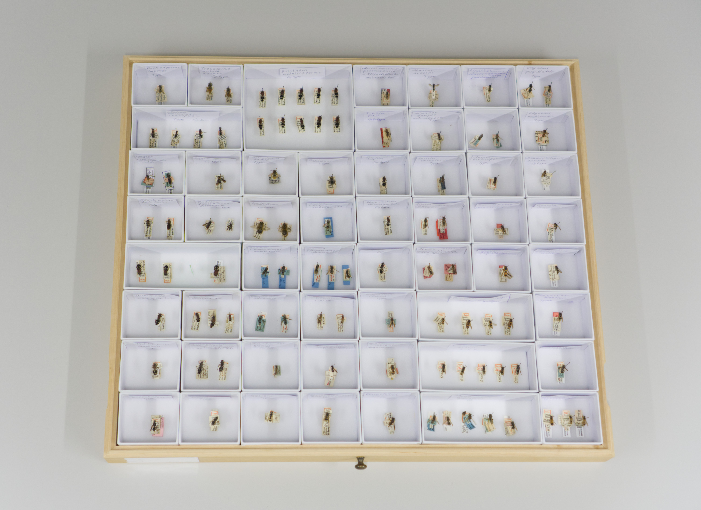
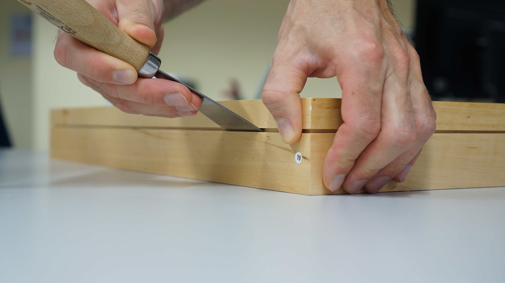
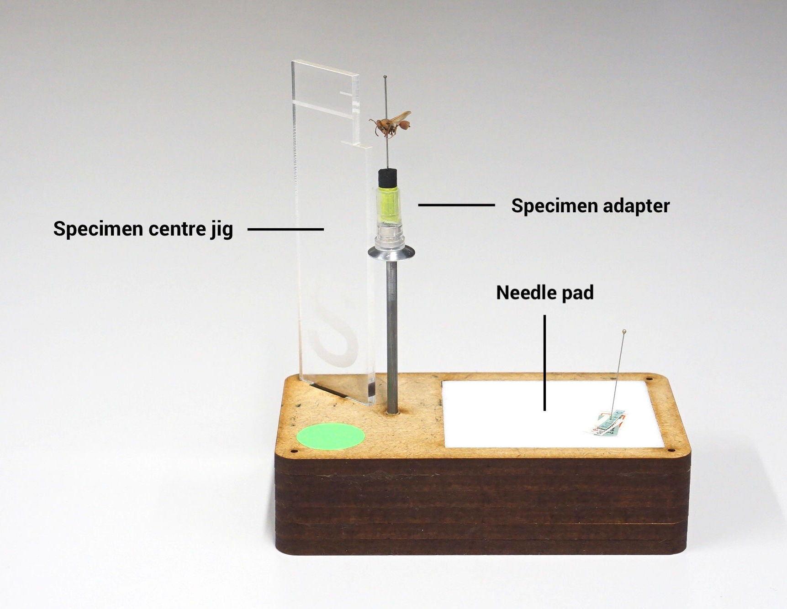
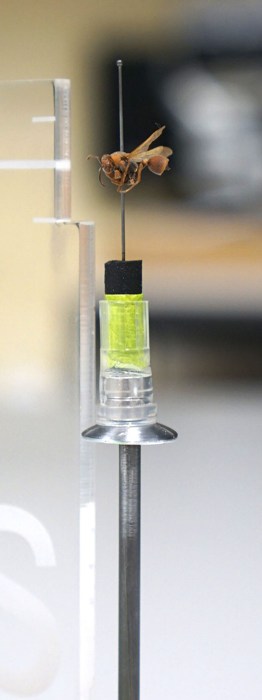
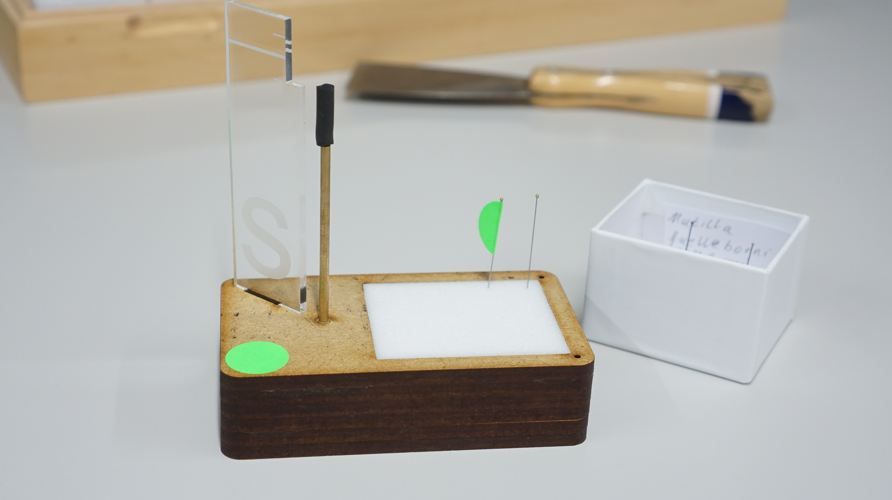
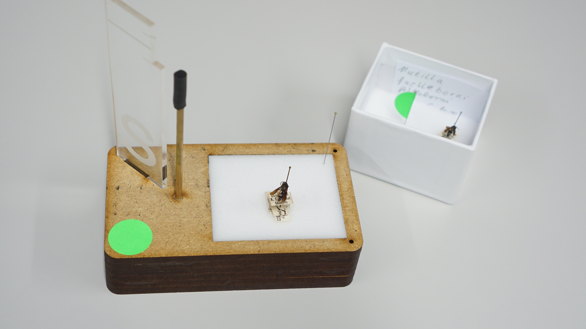
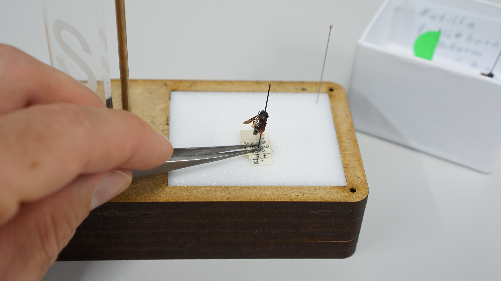
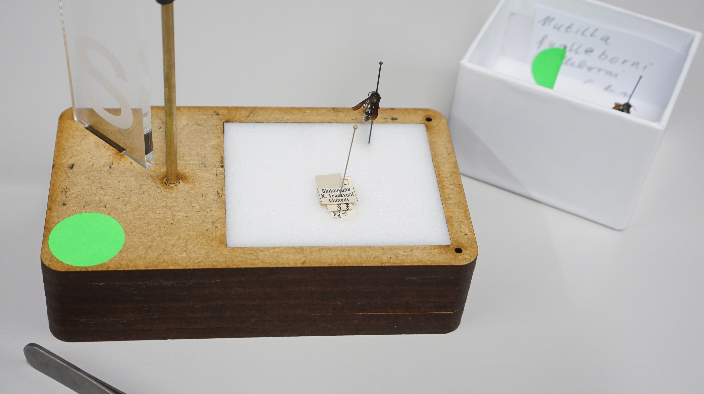
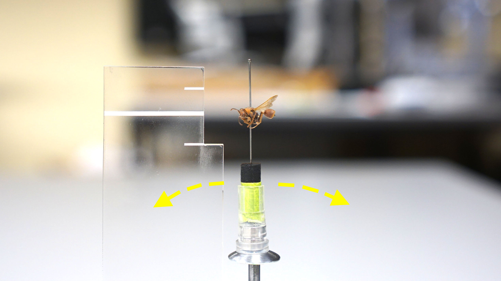
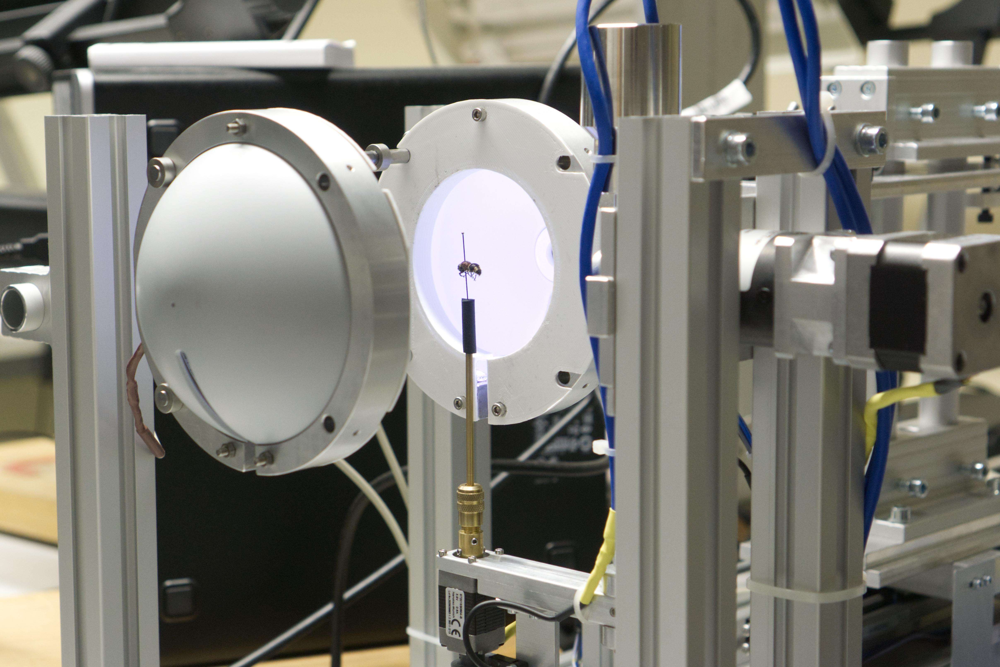

# Handling of specimen

### 5SPECIMEN BOX

The specimen boxes with name-bearing Types are particularly valuable. Please handle it always with the highest attention.

Specimen box

Opening a specimen box

<aside>
📌 Attention: Lifting the lid creates a vacuum (low pressure) in the box. Please lift the lid slowly so that the fragile specimens (especially wings) do not shake. The specimens are dried to be conserved for many years (ETHZ collection up to ~200 years). Unfortunately, the specimens get more brittle over time.

</aside>

### HANDLING OF A SPECIMEN

  
  

### 1 STEP

  
  

1. Put the specimen case next to the adapter stand
2. Take the specimen out of the case and pin it onto the centre of the needle pad
3. Place the needle flag at the exact position of the specimen

### 2 STEP

  
  

1. Push the labels carefully down with the tweezers
2. Take out the needled specimen from the label and pin it on the needle pad
3. Secure the labels with the remaining needle from the pad

### 3 STEP

1. Place the specimen on the specimen adapter
2. The horizontal line of the jig should match the centre of the specimen

### 4 STEP

Please, visit the following chapter [Disc3D Control](https://www.notion.so/Disc3D-00060677c44241f595e987672b3faca2?pvs=21)