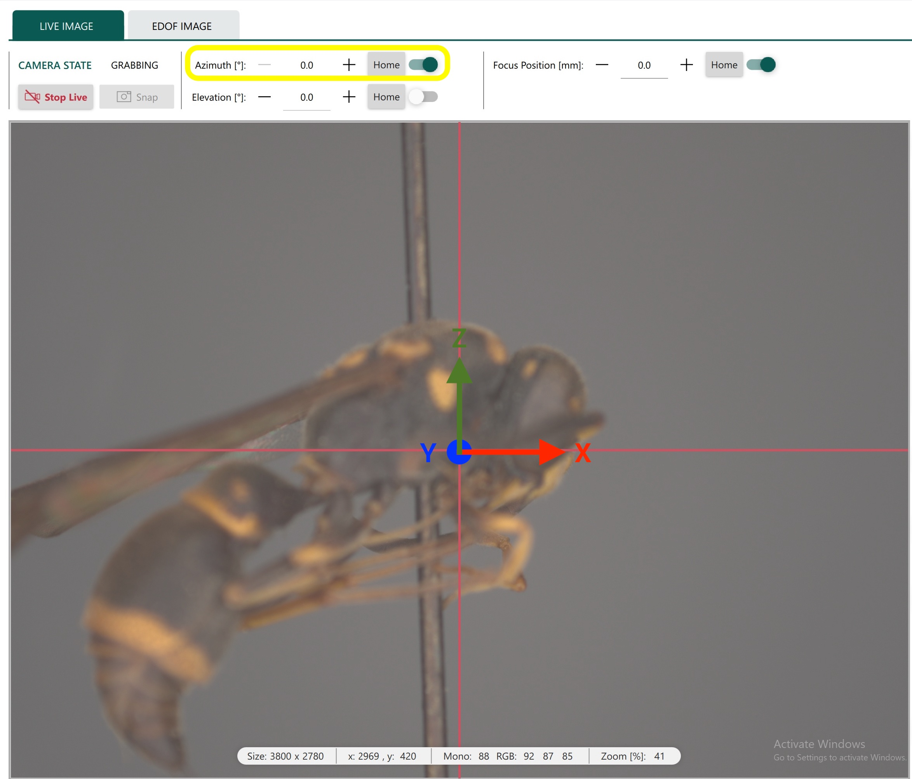
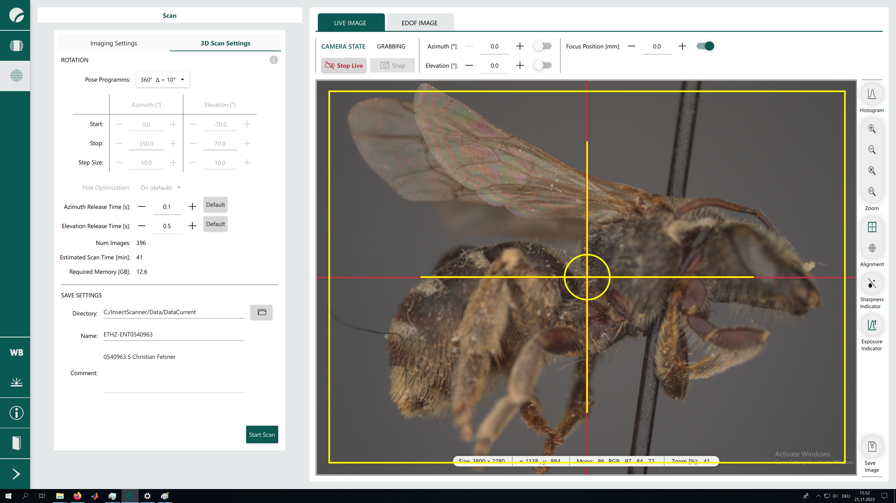
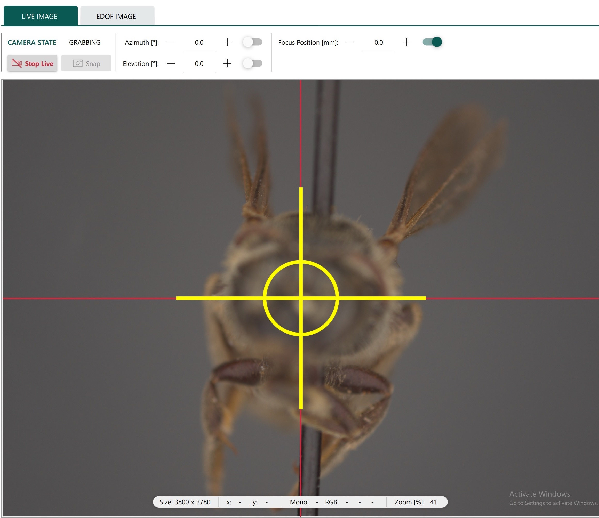
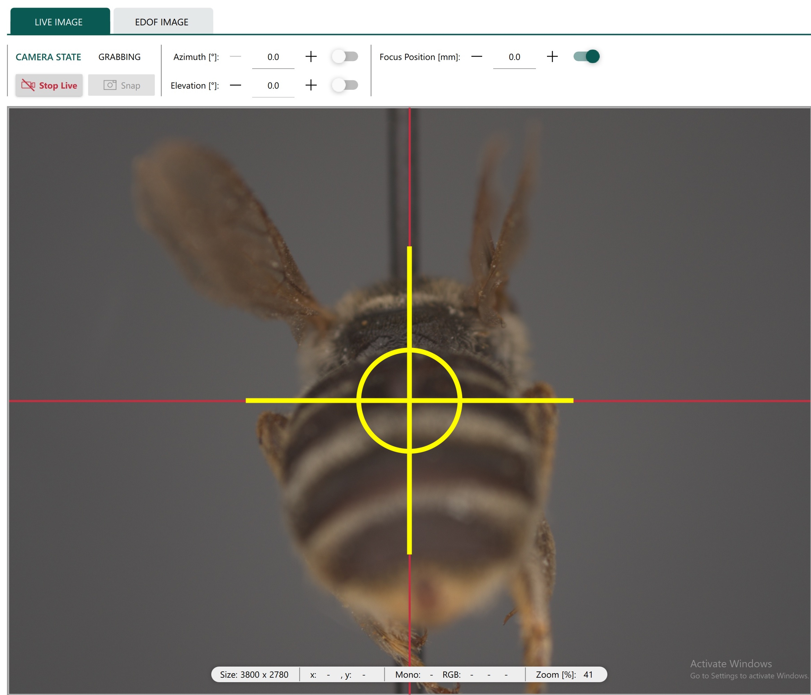
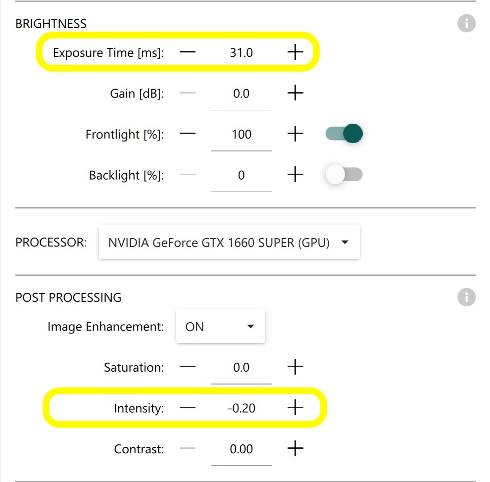
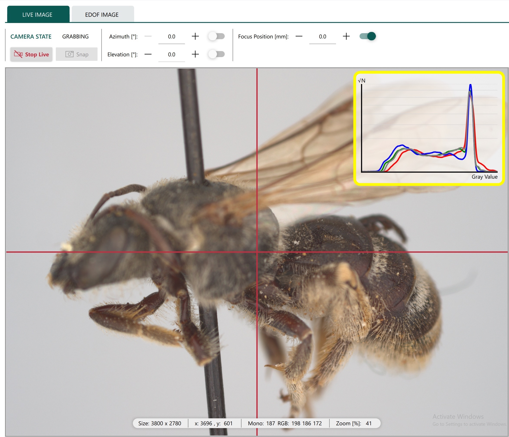
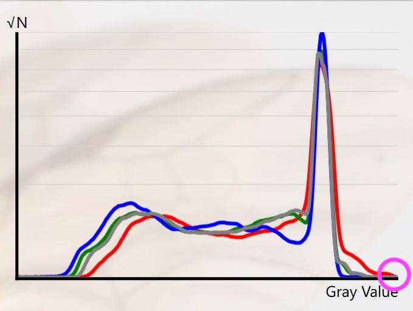
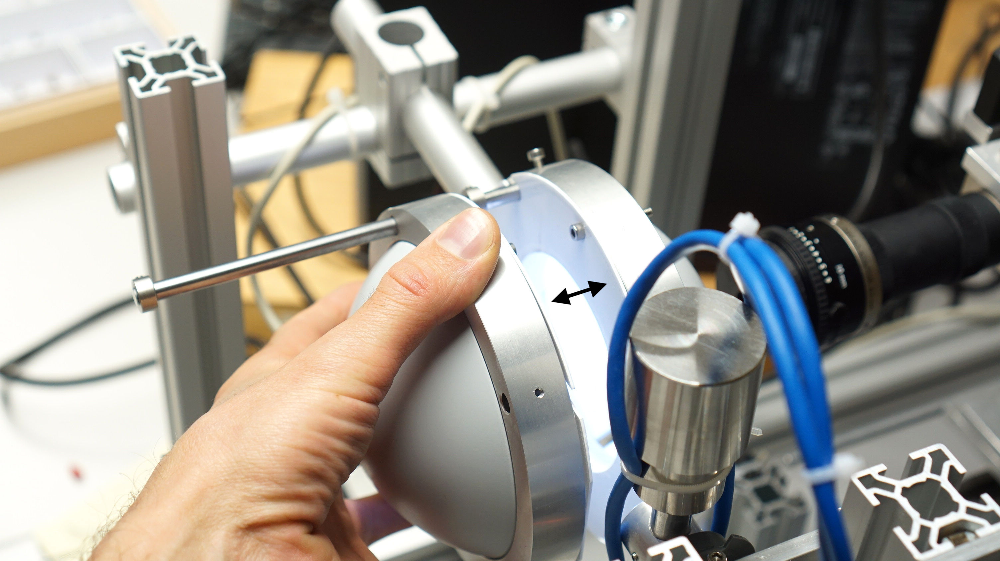

# Specimen placement on Disc3D

### 1 STEP

Switch on Azimuth and turn the specimen to the right side view. That is important for a consistent  alignment of the specimens.

### 2 STEP

Placing of the insect

**Side view;** The centre of gravity should match the centre of the target. The body of the specimen must fit entirely into the yellow frame (the yellow frame is an imaginative ~5mm offset frame of the whole frame). Sometimes wings and legs might not be within the frame.

  
  

**Front and back view;** make sure that the centre of gravity matches the centre of the target. 

### 3 STEP

Image settings

**Recommended values;** *9th of December 2022*

**Exposure time:** Range from 28 to 32
**Intensity:** Range from - 20

Live image histogram

**Vertical axis:** Amount of pixels (RGB)
**Horizontal axis:** Intensity of the colour (RGB)

Make sure that there are no RGB peaks on the right end side! That would indicate an overexposed image.

### 4 STEP

Adjust the background grey to roughly  R 200, G 200, B 200

###