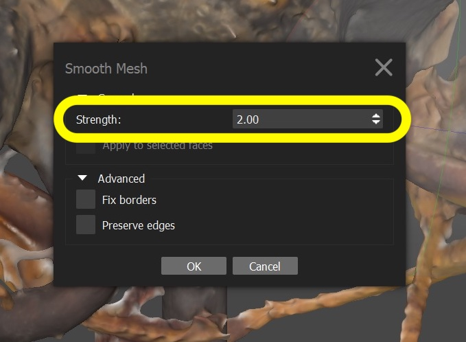
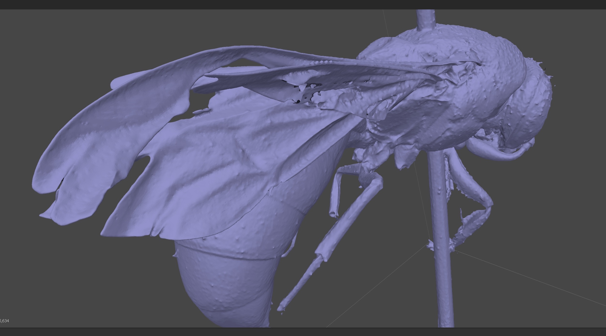

# Create Model

### SETUP

Before you start to process the images created by the ‘disc3D’ scanner make sure that the folder ‘ETHZ-ENTXXXXXX’ is stored locally on ‘C:\InsectScanner\Data\DataCurrent\WEEK XX’. 

<aside>
📌 If the data is not stored locally, the processing time will double due to the data transfer limit of the network.

</aside>

---

### 1 STEP

Metashape UI

### 2 STEP

Menu bar / Window / Add folder

Add Photos context window

Add the ‘edof’ folder with ~396 images from:
‘C:\InsectScanner\Data\DataCurrent\WEEK XX\ETHZ-ENTXXXXXX\edof. 

### 3 STEP

Menu bar / File / Import Reference

Import CSV 

Add the ‘CamPos.txt’ file
‘C:\InsectScanner\Data\DataCurrent\

Coordinate System: mm
**Delimiter:** Space
**Columns:** Label: 1; x: 2; y: 3; z: 4
**Accuracy:** ✔️ all 5

### 4 STEP

ScanInformation.pdf

Menu bar / Tool / Camera calibration

Camera calibration context window

Context window menu point ‘Initial’:
**Type:** Precallibrated
**Copy the ‘f:’** value from the 'ScanInformation.pdf' (Camera constant)

### 5 STEP

Menu bar / Workflow / Align Photos

**Accuracy:** Highest
**Key point limit:** 250,000
**Tie point limit:** 250,000
**Generic preselection:** ✔️
**Nelio: Generic preselection off**
**Reference preselection:** ✔️
**Exclude stationary tie points:** ✔️

Align Photos context window

### 6 STEP

Metashape UI

The calculated cloud points should visualise a clear picture of the specimen.

### 7 STEP

Tools / Optimise Cameras…

**Fit f:** ✔️

### 8 STEP

Menu bar / Workflow / Build Mesh

Build Mesh context window

**Source data:** Depth maps
**Surface type:** Arbitrary (3D)
**Quality:** Ultra high
**Face count:** High
**Interpolation:** Enabled (default)
**Calculate vertex colours:** ✔️ (optional)
**Reuse depth maps:** ✔️

### TWEAKS

For advanced usage of the tweaks please check below:

<aside>
‼️

[Tweak advanced](https://www.notion.so/Tweak-advanced-85b657e1a6624d4a97f6adeec4329139?pvs=21) 

</aside>

Tools / Preferences

Advanced / Tweaks

Tweaks

**BuildModel/ooc_surface_blow_up** 0.75

**BuildModel/ooc_surface_blow_off** 0.75

*BuildModel/occ_surface_blow_off 2*

*BuildModel/occ_surface_blow_up 2*

*No tweak*

*Tvl tweak*

*Blow tweak*

---

BuildModel/occ_surface_blow

*BuildModel/tvl1_mesh = false*

### 9 STEP

Tools / Mesh / Smooth 

**Strength:** 2.00

**Christian: No Smooth**

  
  

Without smooth 

  
  

With smooth 

  
  

### 10 STEP

  
  

**Texture type:** Diffuse map
**Source data:** Images
**Mapping mode:** Generic
**Blending mode:** Mosaic (default)
**Texture size/count:** 4096 x 1

### 11 STEP

Metashape UI

### 12 STEP

Export model