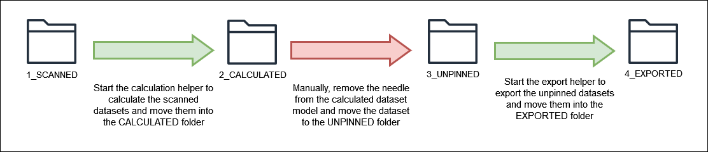
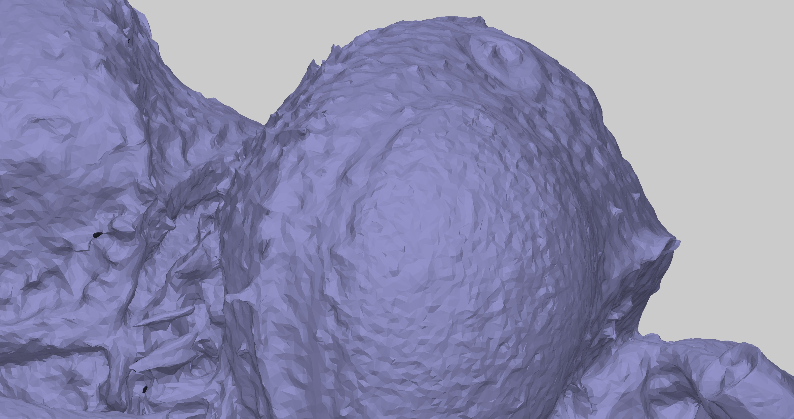
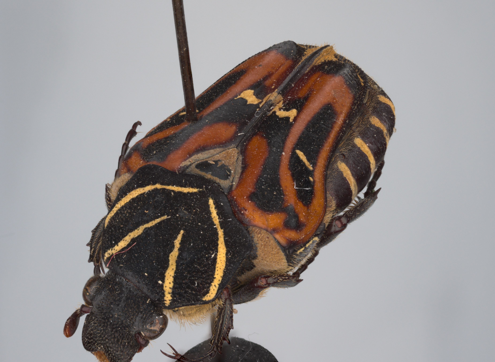
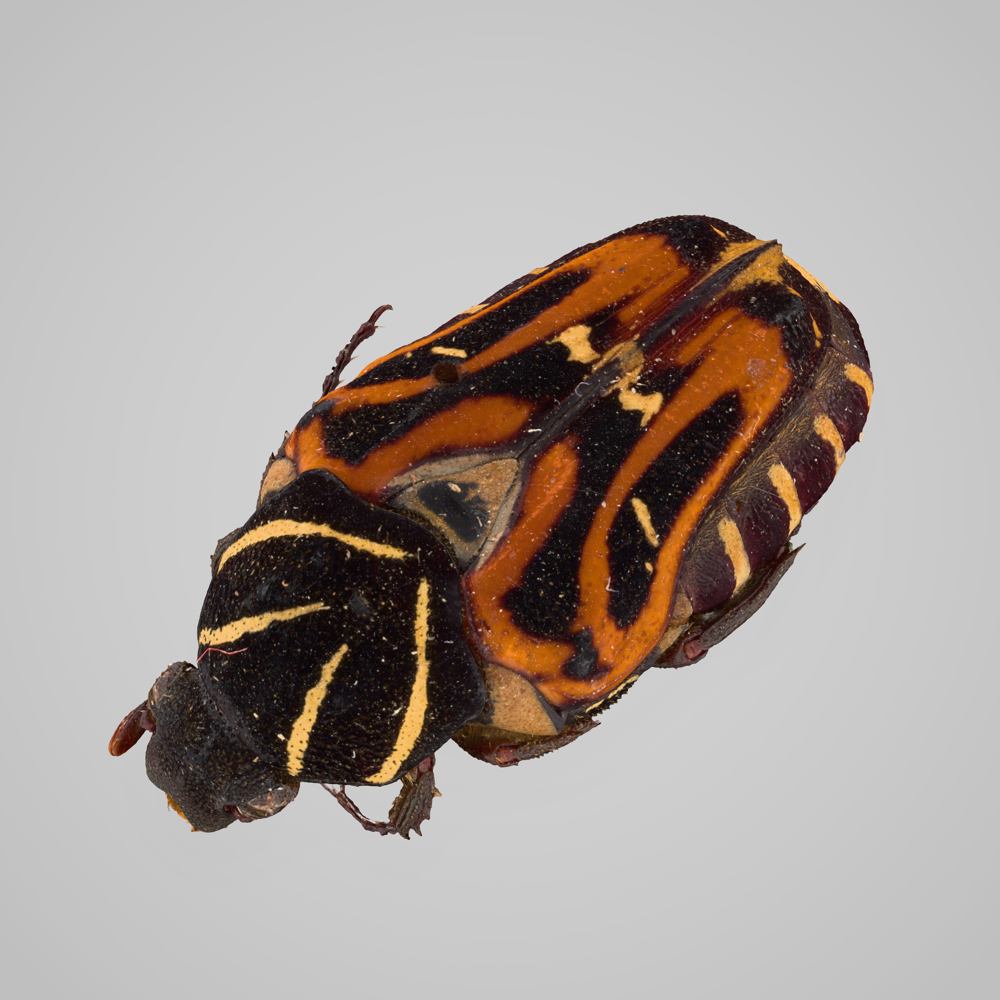
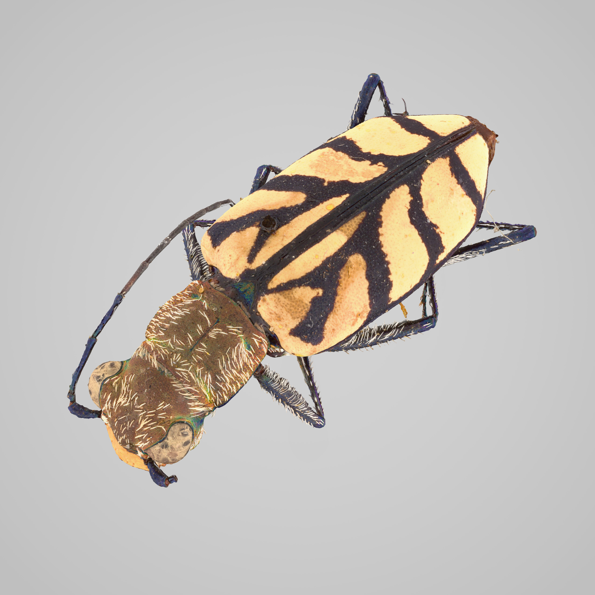

This repository contains all scripts used during the 3D digitization of insect type specimens at the [Entomological Collection at ETH Zürich](https://biocommunication.ethz.ch/entomological-collection.html). The digitization was performed using the 3D-Scanner from [Small World Vision](https://small-world-vision.com/).

# Table of Content
<!-- TOC start (generated with https://github.com/derlin/bitdowntoc) -->

- [Workflow](#workflow)
- [Metashape Helper (01_metashape_helper)](#metashape-helper-01_metashape_helper)
   * [Features](#features)
   * [Dataset structure](#dataset-structure)
   * [Folder Workflow](#folder-workflow)
   * [Usage](#usage)
   * [How it works](#how-it-works)
- [Create Web Optimized Model (02_export_decimate_batch)](#create-web-optimized-model-02_export_decimate_batch)
   * [Instructions](#instructions)
- [Miscellaneous Scripts (03_utils)](#miscellaneous-scripts-03_utils)
   * [Create Preview](#create-preview)
      + [Instructions](#instructions-1)
   * [Extract Projects](#extract-projects)
   * [mCamPos automation](#mcampos-automation)
   * [Blender Automation](#blender-automation)
   * [Extract Images](#extract-images)
   * [Bulk Rename](#bulk-rename)
   * [Metadata](#metadata)
   * [PDF Split](#pdf-split)
   * [Fix PDF](#fix-pdf)
   * [Extract PDF](#extract-pdf)
   * [Final Check](#final-check)
   * [Instructions](#instructions-2)
- [Contact](#contact)

<!-- TOC end -->

# Workflow
After scanning the insect, our workflow looked like the following:

1. Use the [Metashape helper](#metashape-helper-01_metashape_helper) calculate script to create the model from the photo data.
2. Use the [Metashape helper](#metashape-helper-01_metashape_helper) export script to create an .obj file.
3. Use the [Decimate Export](#create-web-optimized-model-02_export_decimate_batch) script to create a .glb file.

These scripts are designed to process multiple projects simultaneously, allowing us to scan many insects during the day and perform calculations overnight without human intervention.

# Metashape Helper (01_metashape_helper)
This script helps with automating the model creation from the edof images. 
## Features

- Calculate and export dataset models with only one click
- Adjust settings only once
- Automatically retrieve the parameters needed from the datasets (f number, camPos, image size, num images)
- Show a progress overview
- Log files for calculation and export

## Dataset structure

The datasets we get from the 3D-Scanners have the following structure:

```
ETHZ-ENT0574269                     --> Dataset folder with unique number
├── edof                            --> Image folder (extended depth of focus)
│ ├── image_0001_-70_0.png          --> Edof image
│ ├── image_0002_-70_29.2.png       --> Edof image
│ ├── image_0003_-70_58.4.png       --> Edof image
│ └── ...                           --> ~395 more edof images
├── ScanInformation.pdf             --> File with scan parameters
└── CamPos.txt                      --> File with camera positions
```

## Folder Workflow
We use four folders to indicate the dataset's state. Every dataset will pass through each folder.

```
1_SCANNED      --> Here are all uncalculated datasets (directly from scanner) stored.
2_CALCULATED   --> Here are all calculated datasets (calculated with the calculation helper) stored.
3_UNPINNED     --> Here are all unpinned datasets (pin manually removed from insect) stored.
4_EXPORTED     --> Here are all exported datasets (exported with the export helper) stored.
```



*Our current workflow*

## Usage

To use the two helpers (calculate/export) do the following:

1. Add datasets into the input folders.
2. Execute the needed helper by clicking on of the `calculate.bat` or `export.bat` file.
3. Wait until the helper has finished processing the datasets or cancel the process by closing the window

If there has been an error you can check out the log file.

Because transparent wings are difficult to reproduce, a batch file is available to override standard settings. These settings inflate the model and then reduce it afterward, improving wing quality.

Ensure that all paths are correctly set in settings.py (and in the batch files if path changes are needed for special cases).

## How it works

1. The settings are validated (`settings.py` & `settings_validator.py`). 
2. If settings are passed through the command line, the standard settings are overriden.
3. The window is created (`helper_window.py` & `tkinter_helper.py`)
4. A new thread is created for the calculation/export (`calculate.py` & `export.py`)
5. The datasets are retrieved from the calculation/export input folder (`dataset_helper.py`)
6. All datasets are calculated/exported (by `metashape_helper.py`)
7. The calculated/exported detasets are moved to the calculation/export output folder (`dataset_helper.py`)

# Create Web Optimized Model (02_export_decimate_batch)
The `.obj` models of the insects are roughly 500MB in size, which is too large for use on websites. To reduce the model size, we follow these steps:

1. Decimate model (reduce polygon count to 1000000). For many applications, this can be reduced further.
2. Remap the texture
3. Export the model  as a `glb` file and apply a fixed metallic/roughness value.

This process is implemented in the `decimate_export_batch.py` script, using Metashape for steps 1 and 2, and pygltflib for the metallic/roughness value. Additionally, the script:

1. Exports the camera positions as an xml file using Metashape. This is necessary to use the models with the [photogrammetry viewer](https://github.com/ULB-Darmstadt/photogrammetry-viewer).
2. Saves all images in the edof folder as JPGs in a folder called redof.
3. Moves the entire project to a new folder


There are two ways to run this script: 

1. Install Metashape as python module
2. Run the script inside Metashape

Right now `decimate_export_batch.bat`, which starts the python script, uses the second variant.
|The full high-poly model.|After decimation|
|---|---|
|||

| The insect | The corresponding .glb |
|---|---|
|| |

## Instructions

1. Install the required libraries: [pygltflib](https://gitlab.com/dodgyville/pygltflib) and [Pillow](https://pillow.readthedocs.io/en/stable/).
2. You can run this script in different ways:
    - Install Metashape as a Python module following the instructions [here](https://agisoft.freshdesk.com/support/solutions/articles/31000148930-how-to-install-metashape-stand-alone-python-module), or
    - Launch the script directly within Metashape. The batch files are configured for this method. Ensure that the Metashape path is correctly specified in the batch files.
3. Adjust the settings in `settings.py` as needed (documentation is provided within the file).
4. Execute the script using either the batch file or a Python interpreter of your choice, depending on your approach in step 

This process takes roughly 5 minutes per insect. If the files are saved on a server it might take slightly longer.

# Miscellaneous Scripts (03_utils)

This folder contains various smaller scripts.

## Create Preview
The `create_preview` project creates three predetermined pictures of the glb models. This is allows for an easy quality control. The current implementation uses a flask server. The extracted images all have a black background. To change this we use a Photoshop automation which automatically adds a white background with a subtle gradient and then exports the file again as a JPEG-file. In the end we have three images:

|top-view|bottom_view|side-view|
|---|---|---|
||||

This can be used in combination with [🖼️ Extract Images](#️-extract-images) to quickly assess the quality of the glb files.

### Instructions

To run this script, ensure you have Flask installed and access to a web browser.

1. Go to the `create_preview` folder.
2. Update the script by replacing `static_folder` with the path to the folder containing your projects. 
3. Move the `main.js` file to the path given above.
4. Start the Flask server using one of the following commands, depending on your Flask installation:`python3.12.exe -m flask --app app run`or`flask --app app run`
5. Open [`localhost:8000`](http://localhost:8000/) in your web browser and press "Start". The program will then automatically capture images of the 3D model from three different perspectives. The images will be saved to your Downloads folder. Make sure your browser is in the foreground the entire time.

## Extract Projects

The `extract_projects.py` file writes all subfolders of a directory to a file. This is useful to extract all projects in a directory.

## mCamPos automation

The `mCamPos_Inner_Outer_NS.py` script is used to automatically duplicates all lines in the `CamPos.txt` file to account for the newly created masking images. This is achieved by simply adding `inner` and `outer` to the image names. This is only required when the insect is placed on top of plexiglass (Lucerne Collection). The new files is saved under `mCamPos.txt`.

## Blender Automation

The `rotate_obj_blender.py`script imports all `.obj` files in blender exports, rotates them and saves the resulting blender project. This assumes all project folders share the same structure, folders that don’t fit this structure get skipped. It also sets the transform orientation to local. 

## Extract Images

Extracts images that are closest to a list of positions. Used in combination with [Create Preview](#create-preview) for quality check.

## Bulk Rename

Copies a file (`ScanInformation.pdf`) and saves it under a different name for all projects. 

## Metadata

Extracts the keywords and rating of the images and exports them as a CSV file. It also keywords of different images of the same insect, such that every insect has a single entry in the CSV file. 

## PDF Split

Splits a PDF into several files where each page in the original is now its own file. 

## Fix PDF

Overwrites certain values in the `ScanInformation.pdf`. It takes these values from a CSV file. It extracts all text from the pdf and writes to a completely new file. This means that the new file look different from the original.

## Extract PDF

Extracts certain values from the `ScanInformation.pdf` file and saves them in a CSV file.

## Final Check

The script `final_check` ensures all project folders have the following files and folders:
```yaml
- cameras.xml
- CamPos.txt
- ScanInformation.pdf or ParamsText.txt
- edof
	- png images
- redof
	- jpg images
- Model
	- MODEL_NAME.files
	- MODEL_NAME.glb
	- MODEL_NAME.mtl
	- MODEL_NAME.obj
	- MODEL_NAME.png
	- MODEL_NAME.psx

```
It also ensures that not too many or too few files exist and allows for some variance. The old folders contain additional files we want to keep. It also makes sure the edof and redof folder contain the same number of images.

## Instructions

These small scripts are standalone programs. Install all dependencies and run them. Each script includes comments for documentation. They are not needed for the process but were helpful for us during the project.

# Contact
- Dr. Michael Greeff - [michael.greeff@usys.ethz.ch](mailto:michael.greeff@usys.ethz.ch)
- Christian Felsner - [christian.felsner@usys.ethz.ch](mailto:christian.felsner@usys.ethz.ch)
